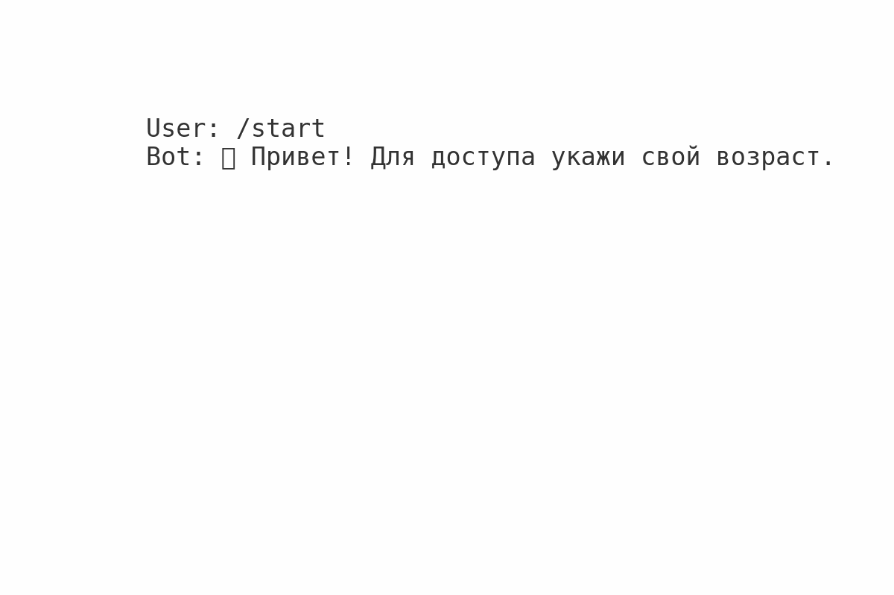

# 🔞 Age Verification Bot for Telegram  

[](https://www.python.org/)  
[](LICENSE)  
[](https://github.com/username/age-verification-bot/issues)  
[](https://github.com/username/age-verification-bot/stargazers)  

Проект для автоматической проверки возраста пользователей в Telegram-боте.  
Полезен для сообществ, где требуется ограничение доступа по возрасту (18+).  

---

## ✨ Возможности  
- 📌 Проверка возраста пользователя при входе в бота или чат  
- 🔐 Поддержка разных методов верификации (дата рождения, документы, API)  
- ⚡ Простая настройка и интеграция  
- 🛠 Кастомизация под любые сценарии  

---

## 🚀 Установка и запуск  

```bash
# Клонируем репозиторий
git clone https://github.com/username/age-verification-bot.git
cd age-verification-bot

# Устанавливаем зависимости
pip install -r requirements.txt

# Запускаем бота
python bot.py
```

---

## ⚙️ Настройка  

1. Создай бота через [@BotFather](https://t.me/BotFather).  
2. Получи `TELEGRAM_BOT_TOKEN`.  
3. Укажи его в `.env` файле:  

```
TELEGRAM_BOT_TOKEN=your_token_here
```

---

## 📚 Использование  

- Добавь бота в чат/канал  
- Настрой правила проверки возраста  
- Готово! 🚀  

---

## 🧩 Технологии  

- [Python 3.x](https://www.python.org/)  
- [python-telegram-bot](https://python-telegram-bot.org/)  
- (опционально) API для верификации документов  

---

## 🗺️ Roadmap  

- [x] Базовая проверка возраста  
- [x] Настройка токена и конфигурации  
- [ ] Локализация (многоязычность)  
- [ ] Интеграция с внешними API для верификации документов  
- [ ] Админ-панель для управления  

---

## 🎥 Демонстрация  

  

---

## 🤝 Контрибьютинг  

Буду рад Pull Request'ам, багрепортам и идеям 💡  

---

## 📄 Лицензия  

MIT License © 2025  
